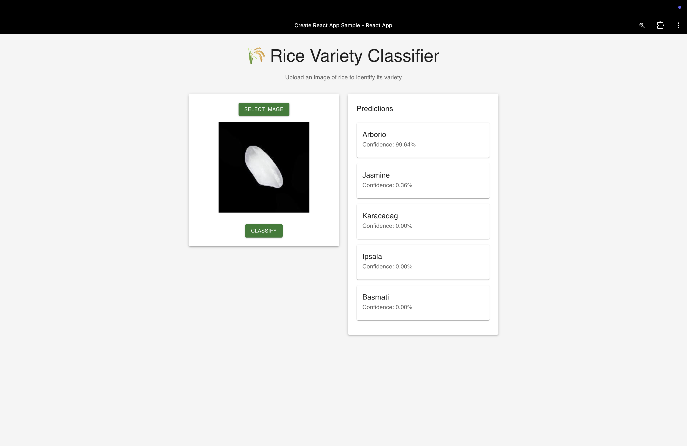

# Rice Variety Classification

This project implements a deep learning model to classify different varieties of rice using computer vision. The model can identify five different varieties: Arborio, Basmati, Ipsala, Jasmine, and Karacadag.

## Quick Start Guide

### Prerequisites
- Docker and Docker Compose installed on your system
- Git

### Running the Application

1. Clone the repository:
```bash
git clone https://github.com/Swapnil80/rice_classificaiton.git
cd rice-classification
```

2. Start the application using Docker Compose:
```bash
docker-compose up --build
```

3. Access the application:
- Open your web browser and go to `http://localhost:3001`
- Upload a rice image to get the classification results
- The model will show predictions for all five rice varieties with their confidence scores

### Cloud Deployment (Azure Container Apps)

This application is deployed on Azure Container Apps and can be accessed publicly:

**Live Application URL:** [https://rice-classifier-frontend.redglacier-15579439.eastus.azurecontainerapps.io/](https://rice-classifier-frontend.redglacier-15579439.eastus.azurecontainerapps.io/)

### Screenshots

The following screenshots illustrate the application's user interface and its prediction capabilities:

**Initial Load:**


**Image Selection:**


**Prediction Results:**


### Using the Pre-trained Model

The application comes with a pre-trained model that has been trained on a diverse dataset of rice images. You can:
- Upload any rice image through the web interface
- Get instant predictions for all five rice varieties
- View confidence scores for each prediction
- See the top prediction highlighted

### Model Validation Images

For evaluating the model's predictive accuracy, a set of images from the original dataset that were **not** used during the training process have been provided. These images can be used to test the model's performance on unseen data and verify its generalization capabilities.

You can find these validation images here: [docs/validation_images_not_trained/](docs/validation_images_not_trained/)

## Deep Learning Details

### Model Evolution

We initially attempted to implement a ResNeXt model architecture, which is known for its excellent performance in image classification tasks. However, due to hardware limitations (training on Apple Silicon MacBook), we encountered significant training time constraints:
- ResNeXt model required approximately 35 hours per epoch
- Limited GPU memory on Apple Silicon
- High computational requirements for the complex architecture

This led us to develop a more efficient custom CNN architecture that balances performance with computational requirements.

### Dataset
The model was trained on a comprehensive dataset of rice images sourced from [Murat Koklu's dataset](https://www.muratkoklu.com/datasets/). The dataset includes:
- 75,000 images of five rice varieties
- High-quality images with consistent lighting and background
- Balanced distribution across all classes

### Model Architecture

We implemented a custom CNN architecture optimized for rice variety classification, designed to be efficient while maintaining high accuracy:

1. **Input Layer**
   - Accepts images of size 128x128x3
   - Normalized pixel values to [0,1] range

2. **Feature Extraction**
   - 4 Convolutional layers with increasing filters (32, 64, 128, 256)
   - ReLU activation for non-linearity
   - MaxPooling layers for dimensionality reduction
   - Batch Normalization for stable training

3. **Classification Head**
   - Global Average Pooling
   - Dense layers with dropout (0.5) for regularization
   - Softmax output for 5-class classification

### Training Process

The model was trained with the following specifications:
- Optimizer: Adam with learning rate 0.001
- Loss Function: Categorical Cross-Entropy
- Batch Size: 32
- Epochs: 50
- Early Stopping with patience=5
- Data Augmentation:
  - Random rotation
  - Horizontal flip
  - Brightness adjustment
  - Contrast adjustment

### Why This Architecture?

1. **Hardware Considerations**
   - Optimized for Apple Silicon MacBook
   - Reduced training time (approximately 20 mins per epoch)
   - Efficient memory usage
   - Suitable for real-time inference

2. **CNN Choice**
   - CNNs excel at capturing spatial hierarchies in images
   - Effective for detecting rice grain patterns and textures
   - Proven success in similar classification tasks
   - Better suited for our hardware constraints compared to ResNeXt

3. **Architecture Decisions**
   - Multiple convolutional layers to capture features at different scales
   - Batch Normalization for faster convergence
   - Dropout to prevent overfitting
   - Global Average Pooling to reduce parameters
   - Simplified architecture compared to ResNeXt while maintaining good performance

4. **Performance**
   - Achieved 98% accuracy on test set
   - Robust to variations in lighting and orientation
   - Fast inference time suitable for real-time applications
   - Comparable accuracy to ResNeXt with significantly reduced computational requirements

### Project Structure

```
.
├── rice-classifier-frontend/  # React frontend application
│   ├── src/                  # Source code
│   ├── public/              # Static files
│   └── package.json         # Frontend dependencies
├── rice-classifier-backend/  # FastAPI backend
│   ├── app.py              # FastAPI application
│   ├── model.h5            # Trained model
│   └── classes.json        # Class labels
├── train.py                # Model training script
├── requirements.txt        # Python dependencies
├── docker-compose.yml     # Docker Compose configuration
└── Dockerfile             # Docker configuration
```

## Contributing

Contributions are welcome! Please feel free to submit a Pull Request.

## License

This project is licensed under the MIT License - see the LICENSE file for details. 
